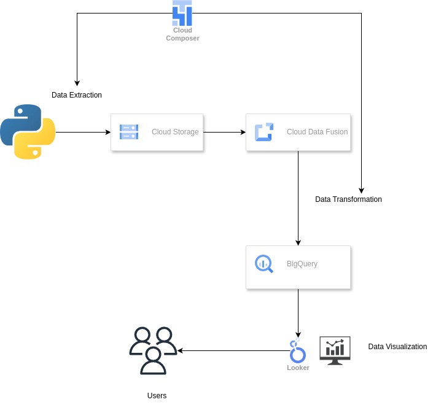
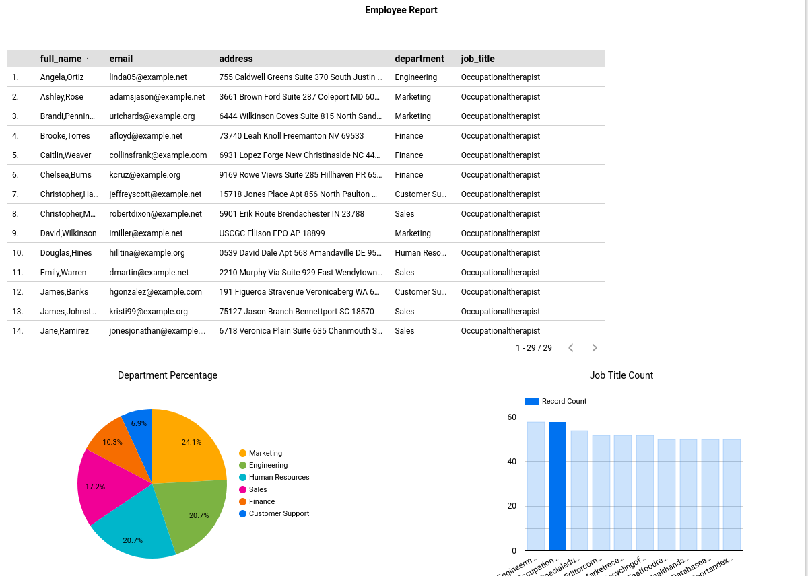

# Employee Data Pipeline

This project involves creating a data pipeline to extract employee data using the Faker library (Python), mask sensitive information within the data, and load it into BigQuery. Additionally, a dashboard is developed to visualize the employee data securely, and the entire process is automated using Cloud Composer (Airflow).

## Requirements

1. **Data Extraction**: Extract employee data from multiple sources such as databases, CSV files.
2. **Data Masking**: Identify sensitive information within the employee data, such as social security numbers, salary details, and personal contact information.
3. **Data Loading into BigQuery**: Design a process to securely load and mask employee data into Google BigQuery.
4. **Dashboard Visualization**: Develop a web-based dashboard using visualization tools (e.g., Google Data Studio, Tableau, etc.).

## Data Set

The dataset includes the following fields:
- `first_name`
- `last_name`
- `job_title`
- `department`
- `email`
- `address`
- `phone_number`
- `salary`
- `password`


## Data Extraction

Data extraction is implemented using Python with the Faker library.

## Data Transformation

Data transformation is performed using Cloud Data Fusion.

## Automation

The entire pipeline is automated using Cloud Composer (Airflow).

## Visualization

Develop a web-based dashboard using your preferred visualization tool, such as Google Data Studio or Tableau, to securely visualize the employee data.

---

### How to Run

1. **Install Dependencies**
    ```
    pip install -r requirements.txt
    ```

2. **Run Data Extraction**
    ```
    python data_extraction.py
    ```

3. **Setup and Run Airflow DAG**
    - Ensure Airflow is set up.
    - Add the DAG `employee_dag.py` to your Airflow DAGs folder.
    - Trigger the DAG via the Airflow UI or CLI.

4. **Visualization**
    - Follow the instructions specific to your chosen visualization tool to connect to BigQuery and create the dashboard.

---

### Images

- ETL Data Pipeline on Google Cloud with Cloud Data Fusion


- Looker Data Visualization


---

### Additional Notes

- Ensure sensitive data is properly masked before loading it into BigQuery.
- Regularly update your Airflow DAG and requirements as needed.
- Secure your data and access controls for the visualization tool to ensure employee data privacy.

